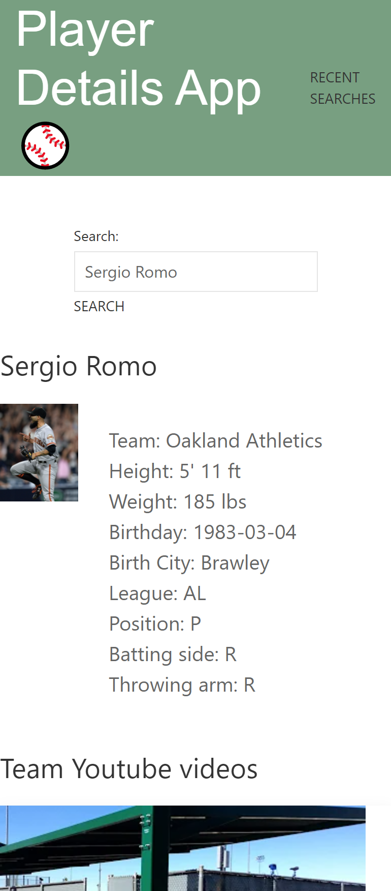

# Game Details App
This site allows baseball fans to search up their favorite player and retrieve specific stats on them. The motivation behind this concept was to allow the user to retrieve quick results without and overload of other unnecessary information. As an added bonus, the user can also load YouTube videos related to their search. We kept in mind that our user wants a simplified design so we ensured the styling of the page reflected simplicity but also relates to the contcept of this site.

# Screenshot
[!Alt image]

## Technologies Used
* HTML
* CSS
* UIKit
* JavaScript
* API calls

## Future Development
- Allowing the user to look up other players within other sports.
- Team roster loading when the player is searched.
- Listing popular players of the season.
- Consistent updates on stylizing.

## Authors
- Analiza Boehning
- Alina Velazquez
- Javier Morales Ruiz
- Hector Romo